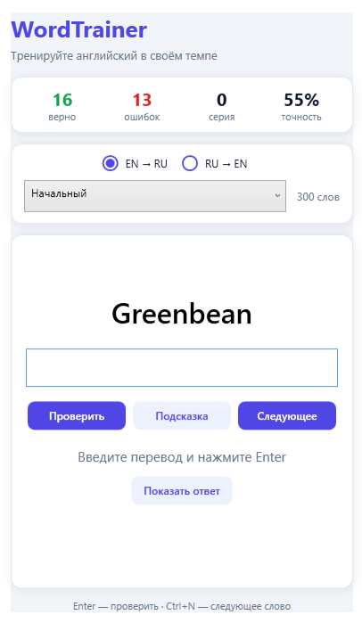

# WordTrainer

?????????? ???????? ?????????? ???? ?? **WPF** (.NET 8). ?????????? ????????? ????????? ????? ?? ????, ?? ??????? ??????? ? ????????? ????????? ?????, ????? ?????????? ?????? ? ???????? ??????? ??? ?????? ??????????.



## ???????????

- **??? ??????:** EN ? RU ? RU ? EN
- **??? ?????? ?????????:** ?????????, ???????, ???????????
- **?????????? ??????:** ????? ?????? ? ???????? ???????, ????? ??????, ???????? ? ?????????
- **?????????:** ?????????? ?????? ????? ??????????? ??????
- **????????? ?????????? ?????????** ? ????? ?????? (????? `,`, `;` ??? `/`)
- **???????????** ? ?????????? ????? ????? ??????????? ??????
- **????????? ???????:** ??? ?????? ??????? ? ?????? ????? ??????????? 18 ????
- **??????? ????** ??? ?????????? ??????

## ??????????

- [**.NET 8 SDK**](https://dotnet.microsoft.com/download/dotnet/8.0) (? ?????????? Windows / WPF)
- Windows

## ??????? ?????

```bash
git clone <url-???????????>
cd WordTrainer
dotnet run
```

?????? ??????:

```bash
dotnet build -c Release
```

??????????? ???? ? ???? ?????? ???????? ? `bin/Release/net8.0-windows/`.

## ??? ????????????

1. ???????? **?????** (EN ? RU ??? RU ? EN) ? **???????** ?????????.
2. ??????? **�?????????�** (??? **Ctrl+N**), ????? ????????? ?????.
3. ??????? ??????? ? ???? ????? ? ??????? **�?????????�** ??? **Enter**.
4. ??? ????????????? ??????????? **�?????????�** ??? **�???????? ?????�**.

### ??????? ???????

| ???????   | ????????              |
|-----------|------------------------|
| **Enter** | ????????? ???????      |
| **Ctrl+N**| ????????? ?????        |

????? ??????? ?????? ????????? ????? ???????????? ????????????? ????? ~0,9 ?.

## ???? ??????

????? ???????? ? SQLite-????? `words.db` ????? ? ??????????? ??????. ??? ?????? ???? ?????????? ? ???????? ????? (`CopyToOutputDirectory` ? `.csproj`).

### ????? ??????? `Words`

| ????         | ???     | ????????                          |
|--------------|---------|-----------------------------------|
| `id`         | INTEGER | ????????? ????                    |
| `eng`        | TEXT    | ????? ?? ??????????               |
| `rus`        | TEXT    | ??????? ?? ???????                |
| `difficulty` | INTEGER | ???????: `1`, `2` ??? `3`         |

### ?????????? ????? ????

???????? `words.db` ????? ???????? SQLite (????????, [DB Browser for SQLite](https://sqlitebrowser.org/)) ? ?????????, ????????:

```sql
INSERT INTO Words (eng, rus, difficulty) VALUES ('achieve', '?????????', 2);
```

????????? ????????? ???????? ? ????? ??????:

```sql
INSERT INTO Words (eng, rus, difficulty)
VALUES ('sophisticated', '??????????; ??????????', 3);
```

??? ???????? ????????????? ????? ?? ????????????? ????????? (???????????: `,`, `;`, `/`).

## ????????? ???????

```
WordTrainer/
??? docs/
?   ??? screenshot.png          # ???????? ??? README
??? App.xaml / App.xaml.cs      # ????? ????? ??????????
??? MainWindow.xaml(.cs)        # ??????? ???? ? ?????? UI
??? DatabaseManager.cs          # SQLite: ?????, ???, ???????
??? TranslationChecker.cs       # ???????? ?????? ? ?????????
??? DifficultyLevel.cs          # ?????? ?????? ?????????
??? Constants.cs                # ?????? ?????????
??? words.db                    # ???? ???? (??????????? ? ???????????)
??? WordTrainer.csproj
```

## ???? ??????????

| ????????? | ??????????        |
|-----------|-------------------|
| ????      | C#                |
| UI        | WPF               |
| ????????? | .NET 8 (Windows)  |
| ??        | SQLite            |
| ?????     | System.Data.SQLite |

## ????????

?????? ???????????????? ?? ???????? [MIT](LICENSE.txt).
